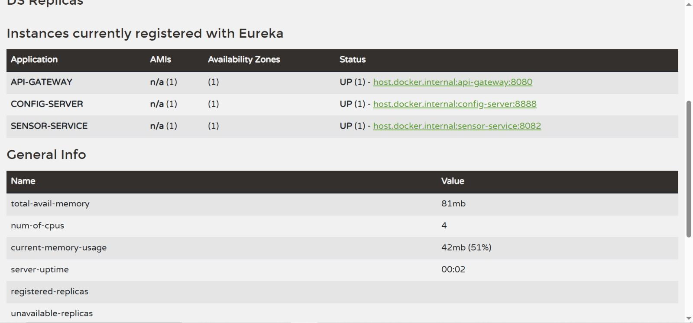

# 🚀 Microservice Architecture Project (Spring Boot + Spring Cloud)

A complete **Spring Boot Microservices system** demonstrating real-world distributed architecture using **Spring Cloud Netflix Eureka, Config Server, and REST-based services**.

This project is designed for learning and implementing **scalable, maintainable, and production-style microservices architecture**.

## 🧭 Overview

This system demonstrates a **microservices architecture** where:

- Each service runs independently
- Services communicate via REST
- Central configuration is managed via Config Server
- Service discovery is handled by Eureka Server

It simulates a scalable backend system used in modern cloud applications.

## 🧩 Microservices Included

### 1. 🟢 Eureka Server (Service Registry)

- Acts as a **service discovery server**
- All microservices register here
- Helps services find each other dynamically

### 2. ⚙️ Config Server (Central Configuration)

- Provides centralized configuration management
- Reads configuration from Git repository
- All microservices fetch config from here

### 3. 📦 Zone Service (Business Microservice)

- A domain-specific microservice
- Handles all operations related to “Zone” entity
- Demonstrates real-world business logic implementation

## 🌐 Base URL
    http://localhost:8080

## 🧠 Key Features

- RESTful API design
- Spring Boot based business logic
- Service registration with Eureka
- Externalized configuration support
- Independent deployment

