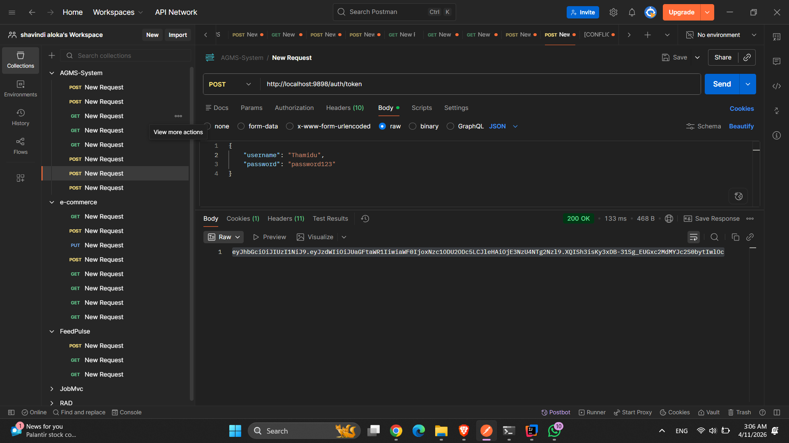
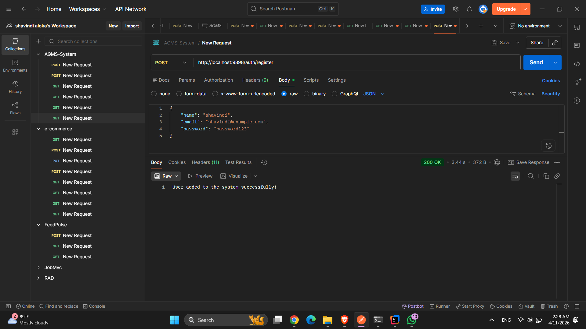
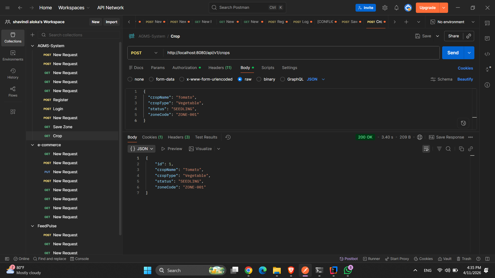
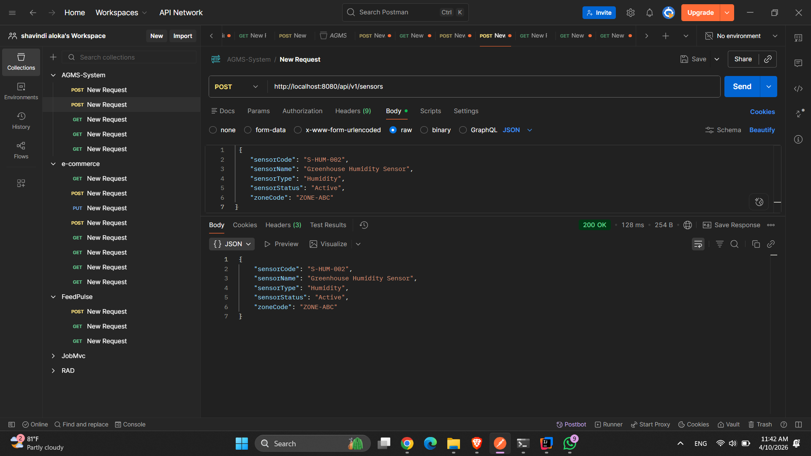
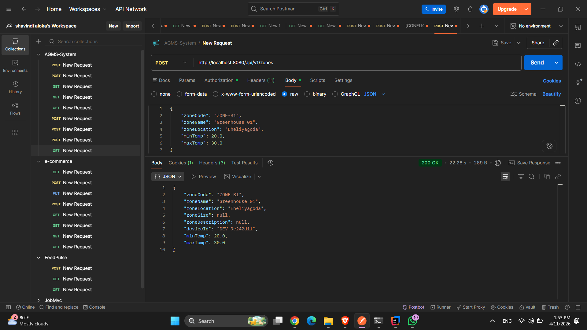

# 🚀 Agricultural Management System (AGMS) - Microservices

This repository contains the backend implementation for the *Agricultural Management System (AGMS), 
a distributed system built using **Spring Cloud Microservices Architecture*. The system is designed to monitor plantation zones, 
track real-time sensor data, and manage crop inventory with automated alerting.

## 🧭 Overview

This system demonstrates a **microservices architecture** where:

- Each service runs independently
- Services communicate via REST
- Central configuration is managed via Config Server
- Service discovery is handled by Eureka Server

It simulates a scalable backend system used in modern cloud applications.

## 🧩 Microservices Included

### 1. 🟢 Eureka Server (Service Registry)

- Acts as a **service discovery server**
- All microservices register here
- Helps services find each other dynamically

### 2. ⚙️ Config Server (Central Configuration)

- Provides centralized configuration management
- Reads configuration from Git repository
- All microservices fetch config from here

### 3. 📦 Zone Service (Business Microservice)

- A domain-specific microservice
- Handles all operations related to “Zone” entity
- Demonstrates real-world business logic implementation

## 🛠️ API Documentation & Testing

### Postman Collection
The AGMS_Collection.json file is located in the root directory. Import it into Postman to test all endpoints.

*Authentication Workflow:*
1.  Use POST /auth/token with valid credentials to receive a JWT.
2.  Copy the token and set it as a *Bearer Token* in the Authorization tab for all other requests.

## 🌐 Base URL
    http://localhost:8080

## 🧠 Key Features

- RESTful API design
- Spring Boot based business logic
- Service registration with Eureka
- Externalized configuration support
- Independent deployment

